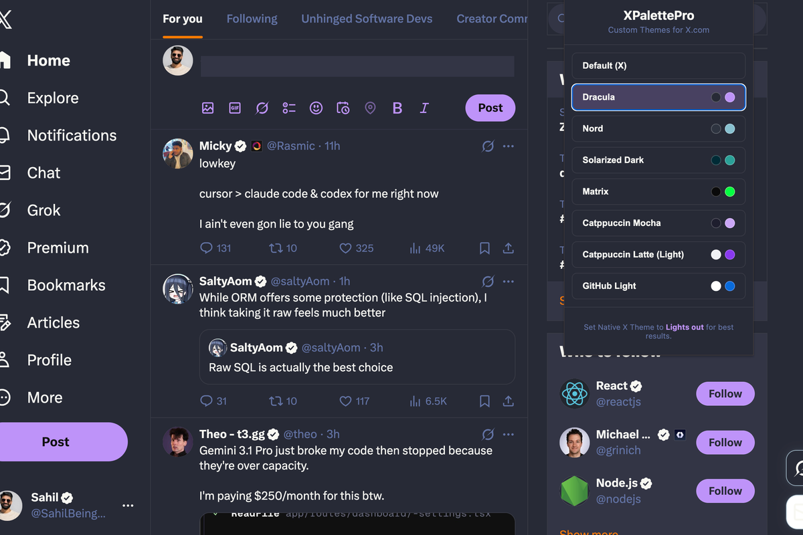
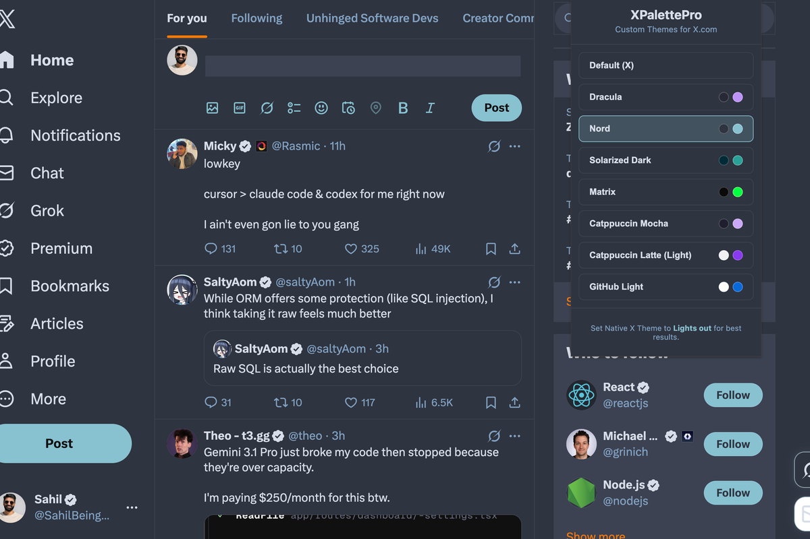
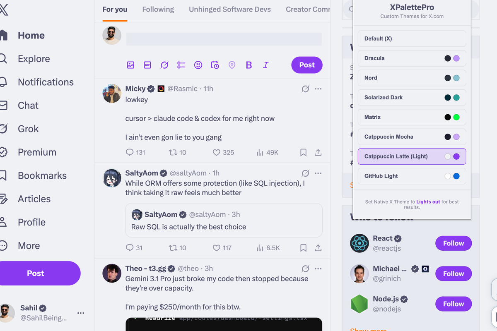

  
  <h1>XPalettePro</h1>
  
<b>A premium theme engine for X/Twitter.</b>

  
Apply curated, high-contrast themes to <code>x.com</code> and <code>twitter.com</code> with instant switching and privacy-first local storage.

 

## Screenshots

  
  
  

## Features

- Curated themes: Dracula, Nord, Solarized, Matrix, Catppuccin (Mocha/Latte), and GitHub Light.
- Instant switching from popup without manual reload.
- CSS-first theming with targeted runtime patching for dynamic X UI surfaces.
- Privacy-first design with no analytics and no external requests.

## Install (Load Unpacked)

1. Clone or download this repository.
2. Open `chrome://extensions/`.
3. Enable `Developer mode`.
4. Click `Load unpacked` and select this project folder.
5. Pin the extension for quick access.

Recommended: set native X appearance to `Lights out` before applying custom themes.

## GitHub Pages Privacy Policy

- Hosted policy page: `privacy-policy.html`
- Repo markdown policy: `PRIVACY_POLICY.md`

If your Pages URL is `https://<username>.github.io/<repo>/`, your policy link is:

`https://<username>.github.io/<repo>/privacy-policy.html`

This URL can be used in extension listing metadata where a public privacy policy URL is required.

## Tech Notes

- Stack: Vanilla JavaScript, CSS, Chrome Extension Manifest V3.
- Content script load order: `themes.js` then `content.js`.
- Storage key: `xp_theme` in `chrome.storage.local`.

## Permissions

- `storage`: saves selected theme locally.
- Host access only for X/Twitter domains required for UI theming.

## Development

Main files:

- `content.js`: theme engine, CSS injection, targeted mutation handling.
- `themes.js`: canonical theme definitions.
- `popup.js` + `popup.css` + `popup.html`: selector UI and theme switch dispatch.
- `manifest.json`: MV3 config and content script registration.

## License / Usage

Add your preferred license if this repository will be publicly distributed.
